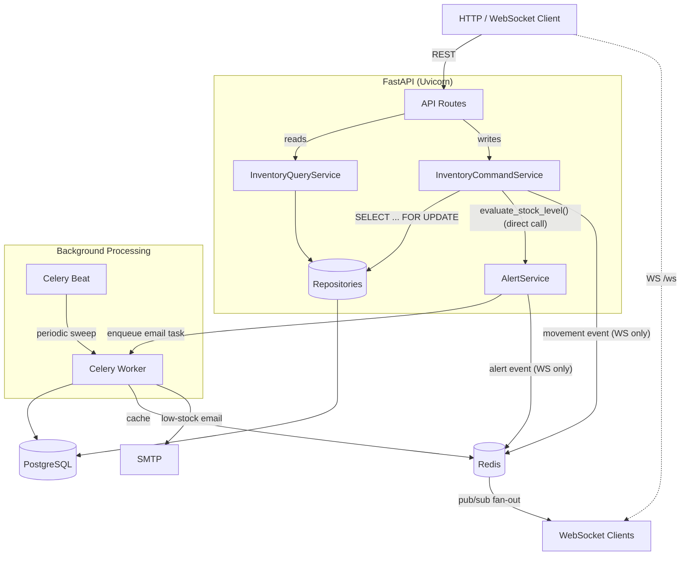
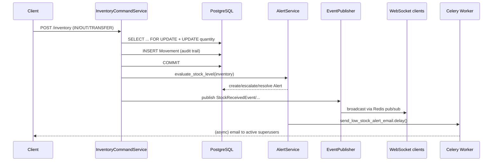

# Inventory Management API

[](https://github.com/MatiasViillalba/inventory-management-api/actions/workflows/ci.yml)
[](https://www.python.org/)
[](https://fastapi.tiangolo.com/)
[](LICENSE)

[](https://www.postgresql.org/)
[](https://www.sqlalchemy.org/)
[](https://redis.io/)
[](https://docs.celeryq.dev/)
[](docker/Dockerfile)
[](tests/)

A production-grade backend for tracking stock across multiple warehouses in
real time — built to demonstrate backend engineering practices beyond a CRUD
tutorial: CQRS on the write-heavy aggregate, an event-driven side-effect
pipeline, row-level locking under concurrent writes, an immutable audit
trail, and a fully asynchronous stack from the HTTP layer down to the
database driver.

**Live API docs:** once deployed, the interactive Swagger UI is served at
`/docs` (see [API Documentation](#-api-documentation)).

---

## Table of Contents

- [The Problem](#-the-problem)
- [Features](#-features)
- [Architecture](#️-architecture)
- [Tech Stack](#️-tech-stack)
- [Project Structure](#-project-structure)
- [Getting Started](#-getting-started)
  - [Option A: Docker Compose (recommended)](#option-a-docker-compose-recommended)
  - [Option B: Local development](#option-b-local-development)
- [Environment Variables](#️-environment-variables)
- [API Documentation](#-api-documentation)
- [Testing](#-testing)
- [CI/CD](#-cicd)
- [License](#-license)

## 🎯 The Problem

A company operating several warehouses needs to know, at any moment, how
much of each product it holds and where — without waiting on a nightly
batch job or a spreadsheet someone forgot to update. This API is the
backend for that: every stock change is applied atomically, triggers a
low-stock alert automatically when it crosses a threshold, is recorded in
an immutable history for audit purposes, and is pushed to connected
clients in real time over WebSockets.

## ✨ Features

- **Multi-warehouse stock control** — add, remove, and transfer stock
  between warehouses, with row-level locking so concurrent movements on
  the same product/warehouse pair never race each other into an
  inconsistent quantity.
- **Automatic alerting** — a product/warehouse pair that drops to or below
  its threshold (configurable per record, with a global default) raises
  a `LOW_STOCK` alert, escalates to `OUT_OF_STOCK` at zero, and
  auto-resolves once stock recovers. A periodic Celery Beat sweep
  reconciles alert state independently of the event-driven path, as a
  safety net against out-of-band database edits.
- **Immutable audit trail** — every stock change is recorded as a
  `Movement` row that is never updated or deleted, so any quantity can be
  traced back to who changed it, when, and why.
- **Real-time push over WebSockets** — stock changes and alerts are
  broadcast to connected clients through Redis pub/sub, so the fan-out
  works correctly across multiple API processes/containers, not just
  within one.
- **Asynchronous background processing** — low-stock email notifications
  and CSV report generation run on Celery, off the request/response
  cycle.
- **Cross-warehouse reporting** — stock summary and valuation reports,
  computed with database-side aggregation (not loaded row-by-row into
  Python), cached in Redis for a short TTL.
- **JWT authentication utilities** — password hashing and token
  issuance/verification are implemented (`app/core/security.py`,
  `app/api/deps.py`); wiring them onto specific routes is a deliberately
  separate step, not yet applied to every endpoint.
- **Structured JSON logging** in non-development environments, with a
  request id threaded through every log line for a single request's
  lifecycle.

## 🏗️ Architecture

The write side of the Inventory aggregate is split from the read side
(CQRS). After a movement commits, `InventoryCommandService` reconciles
alert state with a direct call to `AlertService` — that part is
synchronous, since the caller needs the alert evaluated before the
request returns — and then publishes a domain event purely for
WebSocket broadcasting, which genuinely has no reason to block the
response. `AlertService` publishes its own event too, whenever it
creates or escalates an alert, which is what actually drives the
low-stock/out-of-stock push notifications (not the movement event
itself).



A single stock movement fans out like this:



**Design decisions worth calling out:**

| Decision | Why |
|---|---|
| CQRS split (`inventory_query.py` / `inventory_command.py`) | The write side needs row locking and audit-trail writes; the read side needs neither and can grow caching independently without touching write-side concurrency guarantees. |
| Domain events for WebSockets only, direct calls for alerting | Alert state must reflect the movement that just happened before the request returns, so `InventoryCommandService` calls `AlertService` directly. Nothing downstream of that (WebSocket broadcasting) needs to block the response, so it's reached through a published event instead — `InventoryCommandService` doesn't need to know `app/websockets/listeners.py` exists. |
| Fixed lock ordering in transfers | A transfer's two legs are always locked by comparing warehouse UUIDs, not by which is source/destination, so two concurrent transfers between the same pair in opposite directions can't deadlock on each other. |
| Two separate SQLAlchemy engines (`engine` / `task_engine`) | Uvicorn keeps one event loop for the process's life (a pooled engine is safe); Celery gives every task a fresh loop via `asyncio.run()`, so its engine uses `NullPool` — a pooled asyncpg connection handed back across two different loops fails reliably on Windows otherwise. |
| Redis pub/sub between the event listener and WebSocket broadcast | `ConnectionManager` only knows about connections accepted by its own process. Publishing to Redis instead of calling it directly means a broadcast triggered on one API process reaches WebSocket clients connected to *any* process. |

## 🛠️ Tech Stack

| Layer | Technology |
|---|---|
| Language | Python 3.12+ |
| Web framework | FastAPI + Uvicorn |
| Database | PostgreSQL 16, SQLAlchemy 2.0 (async), Alembic migrations |
| Caching / broker | Redis |
| Background tasks | Celery (worker + Beat) |
| Real-time | WebSockets, Redis pub/sub fan-out |
| Validation | Pydantic v2 |
| Auth primitives | PyJWT, Passlib (bcrypt) |
| Testing | Pytest, pytest-asyncio, httpx, pytest-cov |
| Code quality | Ruff, Black, Mypy (with the Pydantic plugin) |
| Containers | Docker (multi-stage build), Docker Compose |
| CI/CD | GitHub Actions |

## 📁 Project Structure

```text
app/
├── api/
│   ├── deps.py              # Shared FastAPI dependencies (db, redis, auth)
│   └── v1/
│       ├── endpoints/        # One module per resource (warehouses, products, ...)
│       ├── responses.py      # Reusable OpenAPI error-response documentation
│       └── router.py         # Aggregates every endpoint router
├── core/                     # Config, DB session, security, cache, logging, middleware
├── events/                   # Domain event base classes + concrete inventory events
├── models/                   # SQLAlchemy ORM models
├── repositories/             # Data-access layer (one per aggregate)
├── schemas/                  # Pydantic request/response contracts
├── services/                 # Business logic and transaction boundaries
├── tasks/                    # Celery app + task modules
├── websockets/               # Connection manager, Redis pub/sub, listeners
└── main.py                   # FastAPI app assembly

tests/
├── unit/                     # Models, repositories, services (real test DB)
└── integration/               # API endpoints, Celery tasks, WebSockets

migrations/                   # Alembic migration scripts
docker/Dockerfile             # Multi-stage build (shared by api/worker/beat)
docker-compose.yml            # Full local stack (postgres, redis, mailpit, api, celery)
.github/workflows/ci.yml      # Lint, test, and Docker-build pipeline
```

## 🚀 Getting Started

### Option A: Docker Compose (recommended)

Brings up PostgreSQL, Redis, [Mailpit](https://github.com/axllent/mailpit)
(a local SMTP catcher), the API, and both Celery processes — migrations run
automatically in a one-shot `migrate` service before anything else starts.

```bash
git clone https://github.com/MatiasViillalba/inventory-management-api.git
cd inventory-management-api
cp .env.example .env        # adjust values if needed

docker compose up -d --build
```

| Service | URL |
|---|---|
| API | http://localhost:8000 |
| Swagger UI | http://localhost:8000/docs |
| Mailpit (caught emails) | http://localhost:8025 |

### Option B: Local development

Requires Python 3.12+, a running PostgreSQL 16 instance, and a running
Redis instance.

```bash
python -m venv .venv
.venv\Scripts\activate            # Windows
# source .venv/bin/activate       # macOS/Linux

pip install -r requirements/dev.txt

cp .env.example .env              # point DATABASE_URL/REDIS_URL at your local services
alembic upgrade head

uvicorn app.main:app --reload
```

To also run the background processing side locally:

```bash
celery -A app.tasks.celery_app worker --loglevel=info
celery -A app.tasks.celery_app beat --loglevel=info
```

## ⚙️ Environment Variables

All variables are documented with example values in
[`.env.example`](.env.example). The application fails fast at startup if a
required one (`DATABASE_URL`, `REDIS_URL`, `CELERY_BROKER_URL`,
`CELERY_RESULT_BACKEND`, `SECRET_KEY`) is missing.

| Variable | Purpose | Default |
|---|---|---|
| `DATABASE_URL` | Async Postgres connection string (`postgresql+asyncpg://...`) | — (required) |
| `REDIS_URL` | Redis connection string used for caching | — (required) |
| `CELERY_BROKER_URL` / `CELERY_RESULT_BACKEND` | Redis DBs Celery uses for its queue and results | — (required) |
| `SECRET_KEY` | Signs JWT access tokens | — (required) |
| `ALGORITHM` | JWT signing algorithm | `HS256` |
| `ACCESS_TOKEN_EXPIRE_MINUTES` | JWT access token lifetime | `30` |
| `LOW_STOCK_ALERT_THRESHOLD_DEFAULT` | Fallback threshold when a record has none of its own | `10` |
| `CORS_ALLOWED_ORIGINS` | Comma-separated list of allowed origins | `http://localhost:3000` |
| `SMTP_HOST` / `SMTP_PORT` | Where low-stock alert emails are sent | `localhost:1025` (Mailpit) |
| `REPORTS_STORAGE_DIR` | Where generated CSV reports are written | `storage/reports` |

## 📖 API Documentation

Interactive documentation is generated automatically from the code
(FastAPI + Pydantic) and served at `/docs` (Swagger UI) and `/redoc`
(ReDoc) — the root URL (`/`) redirects to `/docs`. It's always in sync
with the code, since it's derived from it rather than hand-maintained.

| Resource | Base path | Description |
|---|---|---|
| Health | `GET /api/v1/health` | Liveness/readiness check, including a DB round trip. |
| Warehouses | `/api/v1/warehouses` | CRUD (soft-delete on remove). |
| Products | `/api/v1/products` | CRUD + name search (soft-delete on remove). |
| Inventory | `/api/v1/inventory` | Read stock levels; `POST` records a movement (IN/OUT/TRANSFER). |
| Movements | `/api/v1/movements` | Read-only audit trail, filterable by product or warehouse. |
| Alerts | `/api/v1/alerts` | List active/historical alerts; resolve one manually. |
| Reports | `/api/v1/reports` | Inventory summary and valuation, aggregated per warehouse. |
| WebSocket | `/api/v1/ws` | Real-time feed; `?channel=<warehouse_id>` scopes it to one warehouse. |

Every documented error response follows the same `{"detail": "..."}`
shape (see `app/core/error_handlers.py`), with the exact 4xx codes each
endpoint can return declared in its OpenAPI `responses` (visible in
Swagger UI, not just in a docstring).

## 🧪 Testing

```bash
pytest                              # full suite
pytest --cov=app --cov-report=term-missing   # with coverage
pytest tests/unit                   # models, repositories, services
pytest tests/integration            # API endpoints, Celery tasks, WebSockets
```

Tests run against a real, isolated PostgreSQL database (`<database>_test`)
rather than mocks or SQLite — the things actually worth testing here
(row-level locking, unique constraints, Postgres-specific column types)
only mean something against the real engine. Each test runs inside a
transaction that's rolled back afterward (via a SAVEPOINT, so it's safe
even when the code under test calls `commit()` itself), so tests never
leak state into one another.

As of this commit: **108 tests, ~88% statement coverage** across models,
repositories, services, API endpoints, Celery tasks, and the WebSocket
connection/broadcast path.

## 🔁 CI/CD

Every push and pull request against `main` runs (see
[`.github/workflows/ci.yml`](.github/workflows/ci.yml)):

1. **Lint** — Ruff, Black (`--check`), Mypy.
2. **Test** — the full Pytest suite against real Postgres/Redis service
   containers.
3. **Docker build** — validates `docker/Dockerfile` still builds.

## 📄 License

MIT — see [LICENSE](LICENSE).
